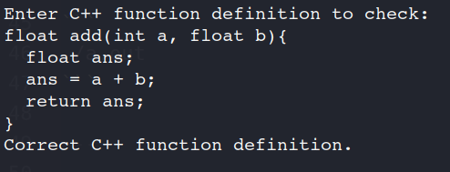
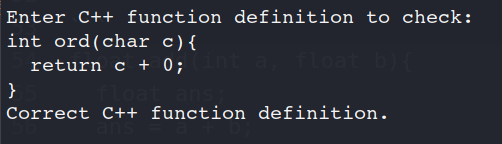
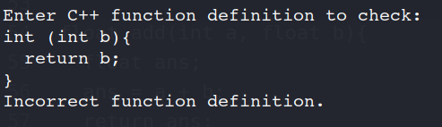
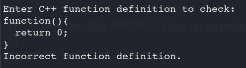

# Parser for C++ Function Definition

---

## Description

A basic parser for parsing C++ function definition using **LEX and YACC**

---

## Syntax 

Syntax of C++ function definition:
```
return_type function_name( parameter list ) {
   body of the function
}
```

## Assumptions

- Basic data types are supported (void, bool, char, int, float, double).
- Default arguments are not supported.
- Comments are not supported.
- Variables have to be declared before initialization.
- Basic arithmetic operators are supported (+, -, \*, /, %).
- Comparison operators are not supported (>, <, <=, >=, ==, !=).
- Standard stream objects are not supported (cout, cin not supported).

---

## Usage

Generate **lex.yy.c file**

```
flex fdef.l
```

Generate **y.tab.c and y.tab.h files**

```
bison -yd fdef.y
```

Compile the **C** files generated

```
gcc lex.yy.c y.tab.c
```

Run program using **a.out file**

```
./a.out
```

---

## Examples
### 1.
```
float add(int a, float b){
  float ans;
  ans = a + b;
  return ans;
}
```
### Output:




### 2.
```
int ord(char c){
  return c + 0;
}
```
### Output:




### 3.
```
int (int b){
  return b;
}
```
### Output:




### 4.
```
function(){
  return 0;
}
```
### Output:



---

## Reference links

- **Lex Yacc Introduction** 
  - [http://epaperpress.com/lexandyacc/intro.html](http://epaperpress.com/lexandyacc/intro.html)
  - [http://dinosaur.compilertools.net/lex/](http://dinosaur.compilertools.net/lex/)
  - [http://dinosaur.compilertools.net/yacc/](http://dinosaur.compilertools.net/yacc/)

- **Lex yacc primer**
  - [http://tldp.org/HOWTO/Lex-YACC-HOWTO-7.html](http://tldp.org/HOWTO/Lex-YACC-HOWTO-7.html)

- **Bison manual references**
  - [http://www.gnu.org/software/bison/manual/html_node/Understanding.html](http://www.gnu.org/software/bison/manual/html_node/Understanding.html)
  - [http://www.gnu.org/software/bison/manual/bison.html#Action-Features](http://www.gnu.org/software/bison/manual/bison.html#Action-Features)
  - [http://www.gnu.org/software/bison/manual/bison.html#Algorithm](http://www.gnu.org/software/bison/manual/bison.html#Algorithm)
  - [http://www.gnu.org/software/bison/manual/html_node/Error-Recovery.html](http://www.gnu.org/software/bison/manual/html_node/Error-Recovery.html)
